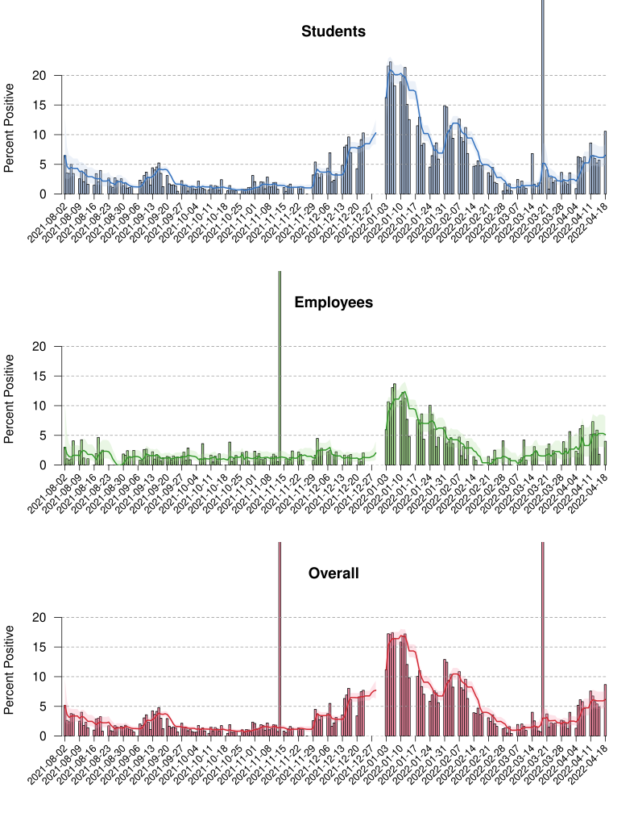

## UW-Madison COVID data, 2021-2022

Plot of data from the [UW-Madison COVID
dashboard](https://covidresponse.wisc.edu/dashboard/) from academic year 2021-2022,
scraped into [`uw_covid_2021.csv`](uw_covid_2021.csv) using a
[python script](https://github.com/kbroman/UWCovid2021/blob/main/scrape_data.py)
based on the
[gist](https://gist.github.com/dgfitch/b6ca1cc61b4795e698cefdf672a90f23)
from [Dan Fitch](https://github.com/dgfitch).

We need the R package [lubridate](https://lubridate.tidyverse.org) and
the python module [requests_html](https://pypi.org/project/requests-html/).

Here, just calculating and plotting the test positivity;
the curves are 7-day running averages.
The shaded regions are pointwise 95% confidence intervals on the 7-day
running averages.
The source is in [`README.Rmd`](https://github.com/kbroman/UWCovid2021/blob/main/README.Rmd).

