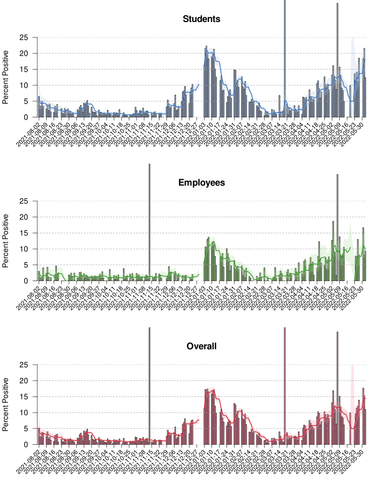

## UW-Madison COVID data, Fall 2021

Plot of data from the [UW-Madison COVID
dashboard](https://covidresponse.wisc.edu/dashboard/) from Fall, 2021,
manually entered in [`uw_covid_2021.csv`](uw_covid_2021.csv).

Here, just calculating and plotting the test positivity;
the curves are 7-day running averages.
The source is in [`README.Rmd`](README.Rmd).

